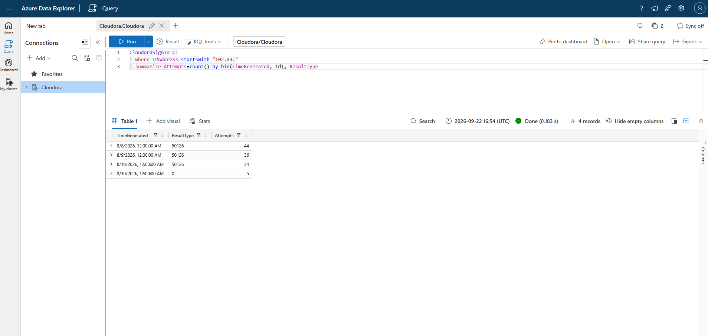
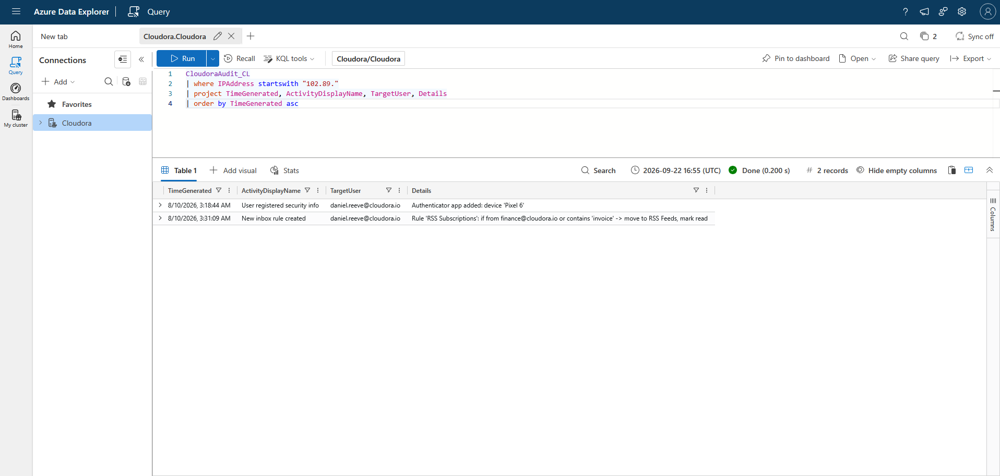
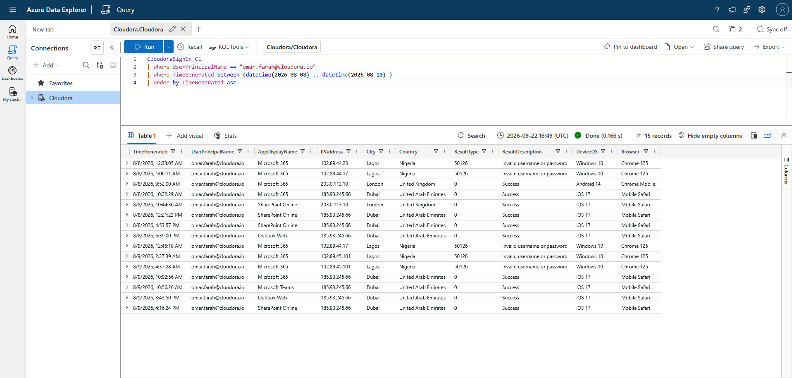
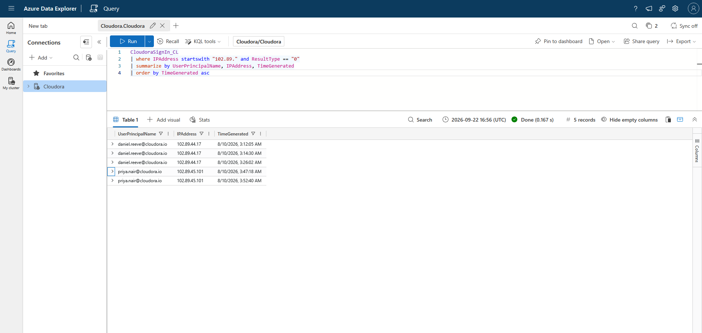

# Security Incident Report: CLD-IR-0001

| | |
|---|---|
| **Report ID** | CLD-IR-0001 |
| **Related ticket** | CLD-0001 Suspicious sign-in activity: daniel.reeve@cloudora.io |
| **Report title** | CEO account takeover via password spray |
| **Analyst** | Radosław Huppert |
| **Date of report (UTC)** | 10-08-2026 |
| **Incident severity** | P1 - Executive account, active enterprise deal |
| **Status** | Contained - eradication verified, monitoring continues|
| **Classification** | This is training copy of fictional company named Cloudora (MyFirstHack scenario) |

---

## 1. Executive summary

Between August 8 and 10, external attacker ran a password guessing campaign against multiple accounts in our company. In the early hours of August 10 attacker guessed correct passwords for two accounts.
daniel.reeve@cloudora.io account (CEO) logged in from Lagos, Nigeria at around 3 AM, but at 8 AM Daniel logged in from London. That is called impossible travel, so IT admin member raised an alert. 
After reviewing suspicious logs, we found that attacker registered their own device and created a hidden email rule that diverts finance and invoice mails. Second compromised account was 
priya.nair@cloudora.io. Compromise was detected same morning after 5 hours of initial access. Both accounts were contained, attacker device and email rule were removed and IPs from Lagos, Nigeria blocked. No further evidence
was found. The remaining 24 accounts that was affected by the attack have been flagged for credentials reset.

---

## 2. Incident timeline

| Time (UTC) | Source | Event |
|---|---|---|
| 8-8-2026 00-05 AM | Sign in | First attempt of password spray from 102.89.x.x IP (Lagos Nigeria) failed 44 logins | 
| 9-8-2026 00-05 AM | Sign in | Second attempt of password spray from 102.89.x.x IP (Lagos Nigeria) failed 36 logins | 
| 10-8-2026 00-05 AM | Sign in | Third attempt of password spray from 102.89.x.x IP (Lagos Nigeria) failed 34 logins | 
| 10-8-2026 3:12:05 AM | Sign in | Successful login from 102.89.44.17 IP into daniel.reeve@cloudora.io account, Windows 10, Chrome 125, initial access mitre: T1078 | 
| 10-8-2026 3:14:30 AM | Sign in | daniel.reeve@cloudora.io opened Outlook Web  | 
| 10-8-2026 3:18:44 AM | Audit | Attacker added own authenticator app on device 'Pixel 6' T1098.005  | 
| 10-8-2026 3:26:02 AM | Sign in | daniel.reeve@cloudora.io opened Azure Portal  | 
| 10-8-2026 3:31:09 AM | Audit | Attacker added new inbox rule which is hiding new emails from finance@cloudora.io or containing 'invoice' T1564.008  | 
| 10-8-2026 3:47:18 AM | Sign in | Successful login from 102.89.45.101 IP into priya.nair@cloudora.io account, Windows 10, Chrome 125, initial access mitre: T1078 | 
| 10-8-2026 3:52:40 AM | Sign in | priya.nair@cloudora.io opened SharePoint Online |
| 10-8-2026 8:41:00 AM | Sign in | Successful login from 203.0.113.11 (London) IP into daniel.reeve@cloudora.io account. Usual IP address and Location |
| 10-8-2026 8:55:00 AM | IT alert | Cloudora IT admin flagged unusual logins from Lagos, Nigeria into daniel.reeve@cloudora.io account | 

---

## 3. Findings

### Finding 1 Password spray before accessing daniel.reeve@cloudora.io account

**Finding:**  
Searching through login attempts there was a password spray attack which has started on august 8th. First night there was 44 failed login attempts(50126), Second night there was 36 failed login attempts(50126) and third night 
there was 34 failed login attempts(50126) and also 2 successful logins into daniel.reeve@cloudora.io account and priya.nair@cloudora.io account.

**Evidence:**  

**Why it matters:**  
This matters because there could be more accounts in the future which can be potential victims. 

---

### Finding 2 Suspicious new device registration on MFA platform 

**Finding:**  
Attacker after successful login into daniel account established persistence through adding device named 'Pixel 6' into MFA application.
It can be seen by checking audit logs filtering by IP (102.89) around 3:18 AM 10-8-2026. 

**Evidence:**  

**Why it matters:**  
It matters because resetting daniel's password will not block attacker from accessing the account.

---

### Finding 3 Attacker established new inbox rule

**Finding:**  
13 minutes after attacker added new device to MFA application in audit logs we can see that added new rule named 'RSS subscription'. It moves new emails from 
finance@cloudora.io or emails containing word 'invoice' into RSS Feeds marking it read. 

**Evidence:**  

**Why it matters:** 
This matters because if Daniel gets any email from finance, or any email containing the word invoice, it is routed out of his normal inbox into a folder he may never check. The attacker can then read that mail and even send replies without Daniel knowing what happened. This could eventually lead to invoice fraud.

---

### Finding 4 Omar Farah's new location login

**Finding:**  
Browsing through SignIn logs i saw that another account logged from another country. To check if his account was also compromised i ran the same queries as for Daniel. Omar logged into his account from Dubai 
on 8-8-2026 at 10:22 AM. All logins from Dubai was successful from first attempt during the day, using his usual user agents. Also we can see that password spray attack is involved into his account from three different
Lagos IP addresses but every attempt was failed. That points Omar logins from Dubai was actually him and not attacker.  

**Evidence:**  

**Why it matters:**  
This matters because it is important to know whether someone is traveling or compromised. It also teaches the idea that you should try to rule out the innocent explanation: Daniel could have just been traveling, and that was not the case.

---

### Finding 5 Priya compromised account

**Finding:**  
Priya Nair was another employee whose account was compromised. Successful login from Lagos IP at 3:47 AM followed by SharePoint Online access. Looking at audit logs i did not find any persistence actions
taken by the attacker. 

**Evidence:**  

**Why it matters:** 
This matters because we know a password spray occurred before Daniel Reeve's account was compromised, so there was always a chance another account fell too.

## 4. Indicators of compromise (IOCs)

| Type | Value | First seen (UTC) | Context |
|---|---|---|---|
| IPv4 | 102.89.44.17 | 8-8-2026 00 AM | Lagos IP, password spray, daniel.reeves compromise |
| IPv4 | 102.89.44.23 | 8-8-2026 00 AM  | Lagos IP, password spray, multiple failed logins to 18 accounts |
| IPv4 | 102.89.45.101 | 8-8-2026 00 AM | Lagos IP, password spray, pryia.nair compromise |
| Device Fingerprint | Windows 10/Chrome 125 | 8-8-2026 | User agent used in password spray attack on all Lagos IP |
| MFA device added  | 'Pixel 6' | 10-8-2026 3:18:44 | Attacker added new device to authenticator app to create persistence |
| Inbox rule | 'RSS subscription' | 10-8-2026 3:31:09 | Attacker added new mail-hiding rule to daniel's inbox |

---

## 5. MITRE ATT&CK mapping

| Tactic | Technique ID | Technique name | Evidenced by |
|---|---|---|---|
| Credential Access | T1110.003  | Brute Force: Password Spraying | Finding 1 |
| Initial Access | T1078  | Valid Accounts  | Findings 1,5 |
| Persistence | T1098.005  | Account Manipulation: Device Registration | Finding 2 |
| Stealth | T1564.008  | Hide Artifacts: Email Hiding Rules  | Finding 3 |

---

## 6. Scope

### Accounts confirmed compromised (2)
daniel.reeve@cloudora.io, priya.nair@cloudora.io both compromised 10-8-2026 from 102.89.x.x Lagos IP addresses. 

- 

### Accounts targeted but not breached (24)

The spray reached 26 distinct accounts in total (query 08). Taking out the two that were breached leaves 24 that need precautionary password resets:
alba.vega, amelia.frost, aria.reid, cole.burke, dina.said, emma.hayes, ethan.wells, freya.lynn, gwen.muir, isla.grant, joel.kerr, jude.ross, kian.patel, leah.stone, lena.voss, liam.doyle, mira.shah, nina.cole, omar.farah, rhys.owen, ruth.dean, ryan.boyd, seth.lane, sofia.marino (all @cloudora.io)

- 

### Accounts investigated and cleared (false positives) (1)

Omar Farah is the only documented false positive. He stays on the reset list above because the spray targeted his account too. Being cleared of compromise does not take him off it.

- 

---

## 7. Actions taken

| Order | Action | Why this order matters | 
|---|---|---|
| 1 | Revoke all active sessions for compromised user and refresh their tokens | It kills attacker live sessions. Reset without killing it leaves existing sessions working | 
| 2 | Reset credentials | It must be done after all sessions are dead | 
| 3 | Removed MFA method 'Pixel 6' from daniel.reeve | Its backdoor for accessing Daniel's account | 
| 4 | Removed inbox rule 'RSS subscription' from daniel.reeve mailbox  | The rule keeps hiding finance mail no matter whose password it is | 
| 5 | Blocked attacker IPs | Blocking attacker infrastructure from accessing company  | 
| 6 | Verified 1-5 steps.  | Containment is a claim until you prove it in the logs | 

---

## 8. Recommendations

1. Password reset for all 24 accounts that was not compromised.
2. Require MFA on all accounts in the company. Its important because accounts was compromised only to password guessing.
3. Alert on creating new mailbox rule for executive accounts and also for new MFA registration.
4. Detection rule on password spraying. Multiple failures for many accounts in a short period of time. 
5. Review Conditional Access. Block authentication from countries without business presence.
6. Brief the team about risk before closing the enterprise financial deal.
7. Verify payment details by phone or known number, not only email trusting.
   

---

## 9. Lessons learned

Lesson learned from this investigation is that if we have had password spray rule we would detect it 51 hours earlier before Daniel's account was compromised. 
Audit logs showed that attacker created backdoor and without it reseting only credentials won't stop the breach. Eradication has to cover everything the attacker changed, not just the way they got in
Baseline comparison between Daniel and Omar prevented false accusation of compromised account. 

> End of report CLD-IR-0001. Training artefact - Cloudora is a fictional company; all data is synthetic. (MyFirstHack)
